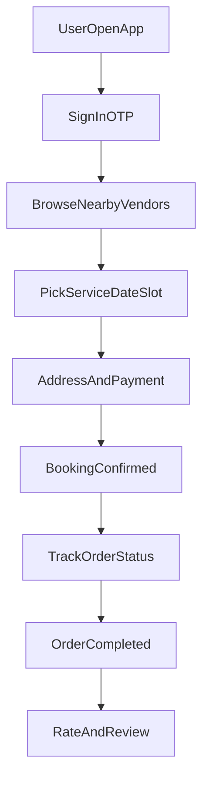
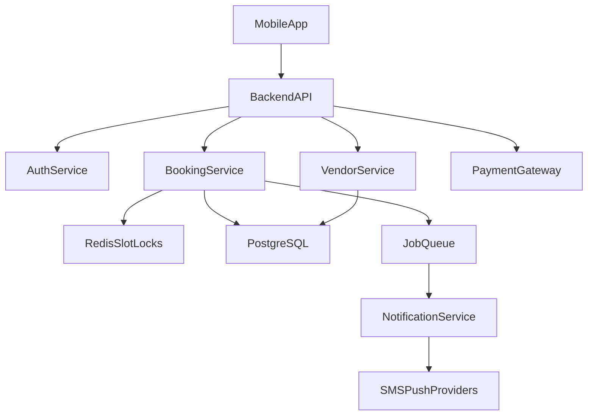

# WashSetu Smart Laundry Slot Booking System

## 1) Brand Direction
- Finalize `WashSetu` as the primary app name; position it as a convenient bridge between users and laundry services (`Setu` = bridge).
- Define one-line value proposition: "Book laundry slots in seconds, skip queues, track every order."
- Create baseline brand kit:
  - Primary colors (clean, trust-focused palette: blue + white + accent green)
  - Logo direction (washing drum + connection/bridge motif)
  - Tone: simple, reliable, neighborhood-friendly
- Draft launch copy for app store and onboarding screens.

## 2) MVP Product Scope

### User Roles
- Customer: discover laundry partners, book pickup/drop slots, pay, track order.
- Laundry Partner (vendor): manage available slots, capacity, pricing, order statuses.
- Admin: onboard vendors, monitor bookings, manage disputes/promotions.

### Core Features (MVP)
- Authentication: phone/email OTP sign-in.
- Location-based vendor listing with filters (distance, price, rating, service type).
- Slot booking engine:
  - Pickup/drop selection
  - Date/time slot availability based on capacity
  - Real-time slot lock during checkout
- Order lifecycle tracking: `Booked -> Picked Up -> Washing -> Ready -> Delivered`.
- Payments: UPI/cards/wallet + COD toggle.
- Notifications: booking confirmation, status updates, reminders.
- Basic ratings/reviews after completed order.

### Nice-to-Have (Post-MVP)
- Subscription plans for recurring laundry.
- Dynamic pricing by peak/off-peak slots.
- Referral and loyalty wallet.
- WhatsApp bot integration for updates.

## 3) User Journey (MVP)

## 4) Technical Architecture

### Recommended Stack
- Mobile app: Flutter (single codebase Android + iOS) or React Native.
- Backend API: Node.js + NestJS (or Express with modular architecture).
- Database: PostgreSQL.
- Cache + locking: Redis (slot reservation + short-lived checkout locks).
- Realtime/async: WebSockets for live tracking; background jobs with BullMQ.
- Auth: Firebase Auth OTP or custom OTP provider (Twilio/msg91).
- Payments: Razorpay or Stripe (region dependent).
- Cloud: AWS/GCP with Dockerized services.

### High-Level System Flow

## 5) Data Model Outline
- `users`: id, role, name, phone, email, default_address.
- `vendors`: id, name, location, service_radius, rating, active.
- `services`: id, vendor_id, service_type, unit_price, eta.
- `slots`: id, vendor_id, date, start_time, end_time, capacity, booked_count.
- `bookings`: id, user_id, vendor_id, slot_id, amount, payment_status, order_status.
- `booking_events`: id, booking_id, status, timestamp, actor.
- `reviews`: id, booking_id, user_id, vendor_id, rating, comment.

## 6) Implementation Phases
- Phase 1: Requirements + UX wireframes + API contracts.
- Phase 2: Auth, vendor listing, slot booking core.
- Phase 3: Payments, order tracking, notifications.
- Phase 4: Partner/admin dashboard basics.
- Phase 5: Testing, performance, security hardening, beta launch.

## 7) Quality, Security, and Ops
- Add input validation and rate limits on auth/booking endpoints.
- Use transaction + Redis lock to prevent double booking.
- Add audit trails for order status transitions.
- Define SLIs/SLOs: booking success rate, slot conflict rate, payment success rate.
- Set up monitoring and alerts for failed jobs and payment webhooks.

## 8) Go-to-Market Starter Plan
- Pilot in one city/area with 10-20 partner laundries.
- Offer first-order discount and subscription prelaunch packs.
- Track activation funnel: install -> signup -> first booking -> second booking.
- Weekly product iteration from cancellation and delay reasons.

## 9) Deliverables to Produce Next
- Product Requirement Document (PRD).
- Figma wireframes for customer + partner app.
- API spec (OpenAPI/Swagger) for MVP endpoints.
- Sprint plan for first 6-8 weeks.